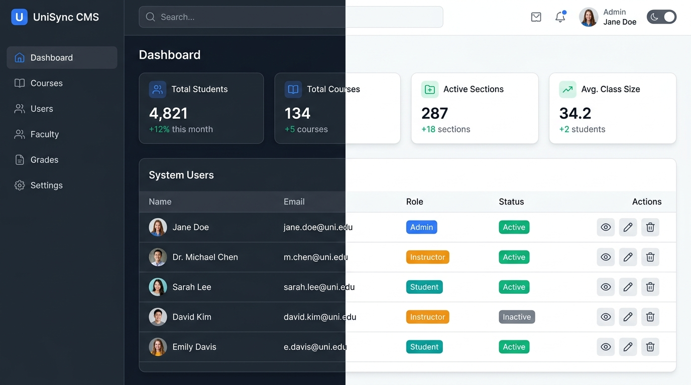
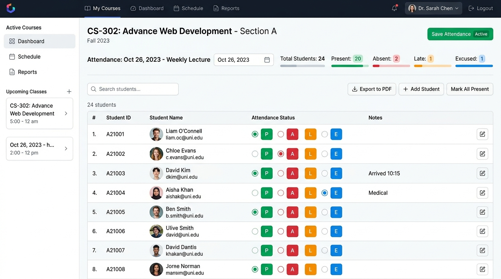
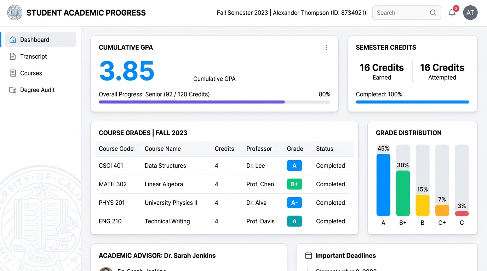

# User Guide & Workflows

This document outlines the core workflows for Administrators, Instructors, and Students within **Student Course Hub**.

---

## Access & Roles Overview

| Role | Access Level | Responsibilities |
| :--- | :--- | :--- |
| **`ADMIN`** | Full System Access | User CRUD, account enable/disable, course catalog management, section allocation. |
| **`INSTRUCTOR`** | Assigned Sections | Roster inspection, session generation, attendance logging, assignment creation & grading. |
| **`STUDENT`** | Enrolled Sections | Course catalog search, section registration/dropping, attendance view, grade & GPA tracking. |

---

## 1. System Administrator Workflow

### User Account Management
1. Log in with admin credentials (`admin@smartcoursehub.com` / `admin123`).
2. Navigate to **User Management** (`/admin/users`).
3. Click **Create New User** to register a new Student, Instructor, or Administrator account.
4. Toggle user account status (**Disable** / **Enable**) to manage platform access without deleting records.

### Course Catalog & Section Creation
1. Navigate to **Courses** (`/admin/courses`) to create or update course codes and credit hours.
2. Navigate to **Sections** (`/admin/sections`) to allocate course sections to term semesters, rooms, and assigned faculty instructors.

---

## 2. Faculty Instructor Workflow

### Managing Section Rosters & Attendance
1. Log in with instructor credentials.
2. View assigned sections on the **Instructor Dashboard** (`/instructor`).
3. Select a section to view enrolled student rosters and details (`/instructor/sections/:id`).
4. Click **Generate Weekly Sessions** to create term class dates.
5. Click **Mark Attendance** for a session to set student statuses (`PRESENT`, `ABSENT`, `LATE`, `EXCUSED`).

### Creating & Grading Coursework
1. Navigate to **Manage Assignments** (`/instructor/sections/:id/assignments`).
2. Create an assignment specifying title, total marks, and deadline.
3. Click **Grades** to view student submissions and record numeric scores.

---

## 3. Enrolled Student Workflow

### Course Registration & Drop
1. Log in with student credentials.
2. Browse open courses in **Available Courses** (`/student/courses`).
3. Click **Enroll** to register for an open section seat (system verifies capacity limits and duplicate course checks).
4. Manage current active enrollments under **My Enrollments** (`/student/enrollments`).

### Academic Progress & GPA Tracking
1. Navigate to **Academic Progress** (`/student/progress`).
2. Filter by semester term or view cumulative GPA, total earned credit hours, and detailed grade reports.
